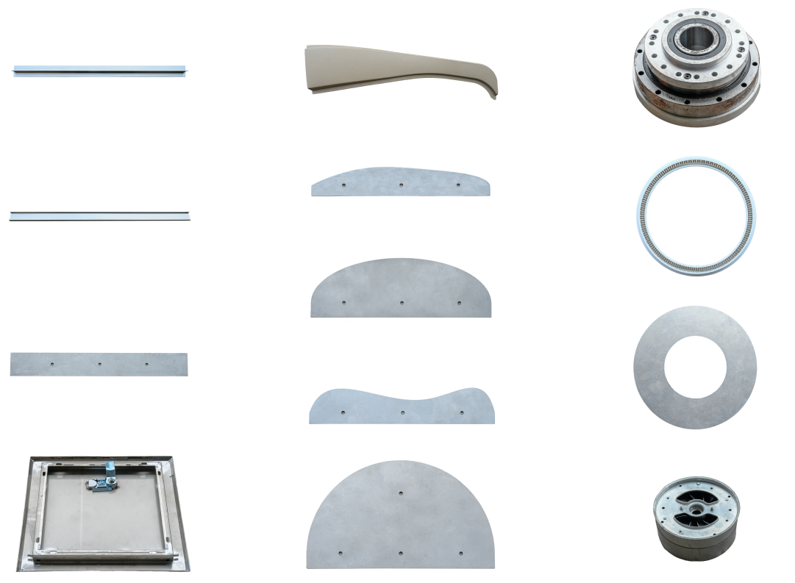

# RGB-D Coating Dataset

## Overview
This dataset contains **130 samples** of seal coating trajectories for **13 industrial parts** (1,690 data groups in total). Data was captured using an RGB-D based robotic system, including color images, depth information, seam points annotations, seam mask ground truths, taught trajectory annotations, and robot transformation matrices. The full dataset is available for download [https://zjueducn-my.sharepoint.com/personal/3190103740_zju_edu_cn/_layouts/15/download.aspx?UniqueId=48ba9103%2Ddbed%2D4005%2Dac39%2D72d29fb2de99](here).

<p align="center">
  
</p>


## Directory Structure
```
RGBD_Coating_Dataset/
├── circle/                         # Circular trajectory parts (4 types)
│   ├── circle_1/                   # Type 1 circle samples
│   │   ├── color/                  # RGB images (JPG)
│   │   ├── depth/                  # Raw depth maps (TIFF)
│   │   ├── json/                   # Seam points annotations (JSON)
│   │   ├── mask/                   # Thick mask ground truths (PNG)
│   │   ├── trajectory/             # Taught robot trajectories and robot transformation matrices(NPZ)
│   ├── circle_2/
│   └── ...
├── curve/                          # Curved trajectory parts (5 types)
├── straight/                       # Straight trajectory parts (4 types)
├── scripts/                        # Data processing scripts
├── img/                            # Workpieces images
└── README.md/                      # README
```

## Data Description
| Folder            | Subset      | Format      | Description                                                         |
|-------------------|-------------|-------------|---------------------------------------------------------------------|
| color/            | 2D-SSCN     | JPG         | RGB images (1440×1080)          |
| depth/            | 2D-SSCN     | TIFF        | Aligned depth maps (1440×1080)     |
| json/             | 2D-SSCN     | JSON        | Seam points annotations by LabelMe      |
| mask/             | 2D-SSCN     | PNG         | Binary masks generated from the seam points annotations with the thickness of 20 pixels |
| trajectory/       | 3D-SRTN     | NPZ         | 1. Taught robot trajectories in the robot base frame <br> 2. Corresponding transformation matrices of robot base to glue end frame <br> 3. Transformation matrices of glue end to camera frame    |


## Usage Notes
1. **Mask Generation**: 
`scripts/generate_mask.py`: Use `json/` 2D key points annotations to generate the thick mask and thin mask with specific thickness. (We give an example of generating the thick mask with thickness of 20 pixels in the mask folder)
2. **Trajectory Generation**: 
`scripts/generate_trajectory.py`: Combine `trajectory/` 3D key points annotations to generate and visualize the smooth and evenly spaced trajectory.
3. **Coordinate Transformation**: 
Use transformation matrices in `trajectory/` to convert camera coordinates to robot base frame.
4. **Data Pairing**: 
Files with matching indices (e.g., `color/1.jpg`, `depth/1.tiff`, `json/1.json`, `mask/1.png`, `trajectory/1.npz`) belong to the same sample.


